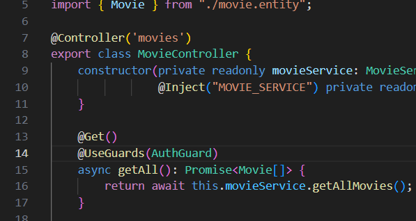
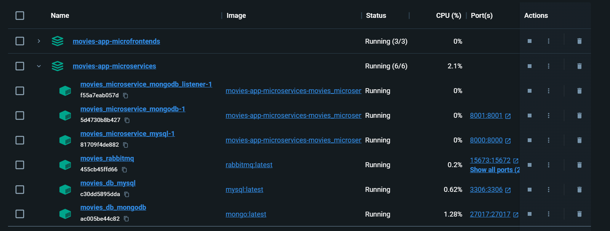
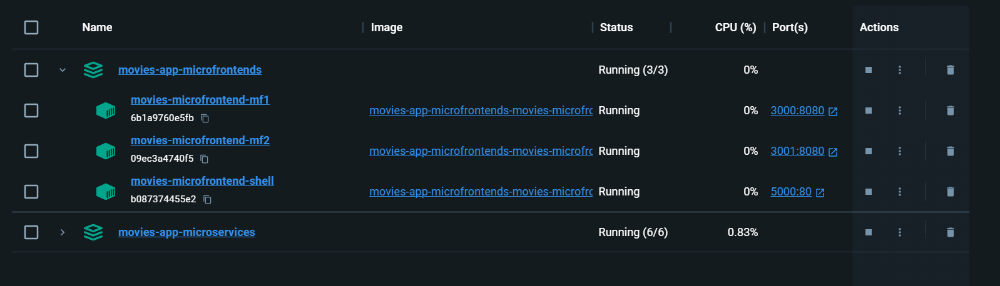
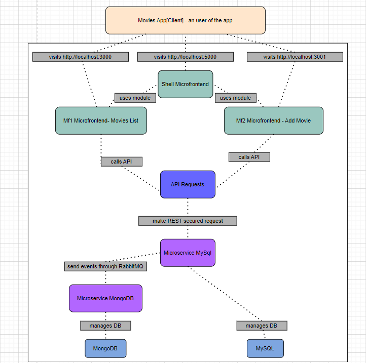
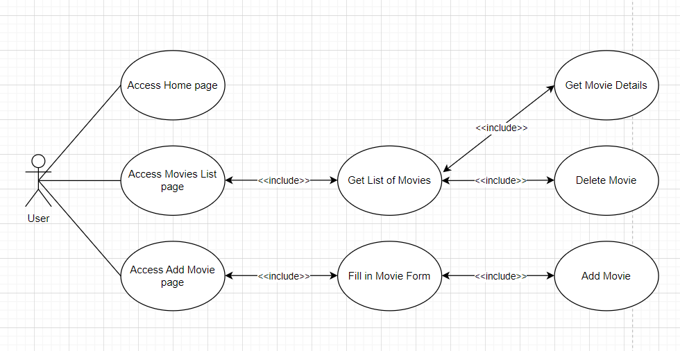

# Service Oriented Architecture #
# Movies App in NestJS and Angular #

## Description of the system
The system is a web application based on a **Web Server** containing 2 microservices created with NestJS that communicate with RabbitMq message broker and a **Web App** using micro frontends. 

The system allows CRUD operations on movies entities which are handled separately by the microfrontends: one microfrontend provides the layout of the app and the landing page (**shell**), another one allows viewing the entire list of movies that the app is storing plus deletion of a specific selected movie (**mf1**) and finally, the third one allows inserting a new movie in the app (**mf2**). At API level, requests are registered by one microservice (**movies-microservice-mysql**) which does the corresponding actions in a MySQL database and then broadcasted to the other microservice (**movies-microservice-mongodb**) through RabbitMQ message brocker, which syncs a MongoDB database.

As mentioned, the app is centered around a **Movie** entity that can be described by its atributes: Id (unique number), Title(string), Year (number), Genre(string), Synopsis(string), Image URL (string).

## Main Workflows ##
1. When adding a new movie from the web app (through **mf2** form that is displayed in the **shell** app) a POST request is sent to the **movies-microservice-mysql**, creating a new record in MySql database. The create event is broadcasted in a queue via RabbitMq, where **movies-microservice-mongodb** listens to. It then creates a related entry in MongoDB database.
2. Getting the list of movies in **mf1** is done through a simple request to **movies-microservice-mysql** which gets the movies from MySql DB.
3. Deleting a movie in **mf1** works on the same principle as adding a movie.

# Architecture #
## The Web Server ##
### Microservices ###
 - **movies-microservice-mysql**
    - NestJs controllers with CRUD operations
    - Connected to MySq
    - **Secured REST API** with Auth0
    
    - **Message broker RabbitMQ** emit event which adds in queue
 - **movies-microservice-mongidb**
    - NestJs controllers with CRUD operations
    - Connected to MongoDB
    - **Message broker RabbitMQ** listen to events

## The Web App ##
Microfrontends architecture in Angular using Webpack Module Federation plugin
- **shell**
    - Main layout of the app that loads the other microfrontends
- **mf1**
    - Consumes REST API from **movies-microservice-mysql** (get, delete)
- **mf2**
    - Consumes REST API from **movies-microservice-mysql** (create)

## Containers ##
### Docker ###
 - movies-app-microservices container images:
    
 - movies-app-microfrontends container images:
    

# C4 Models #

# UML #
